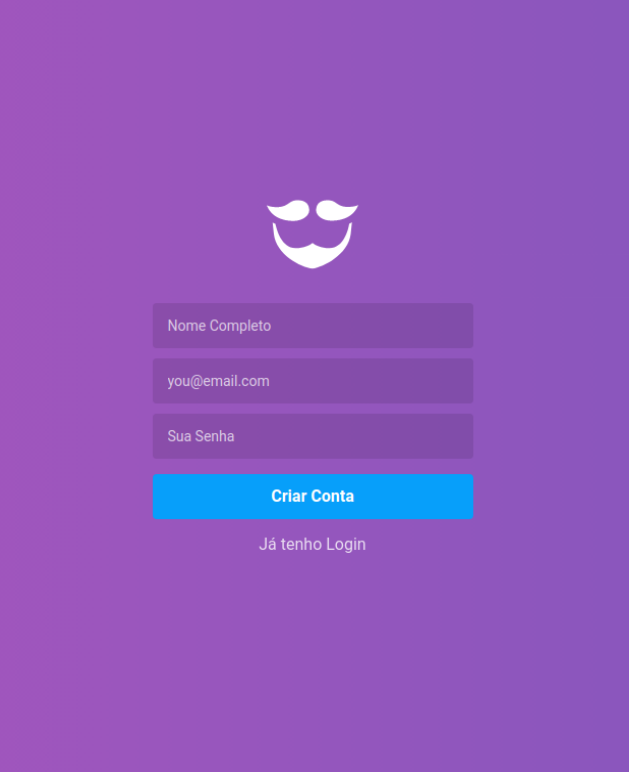
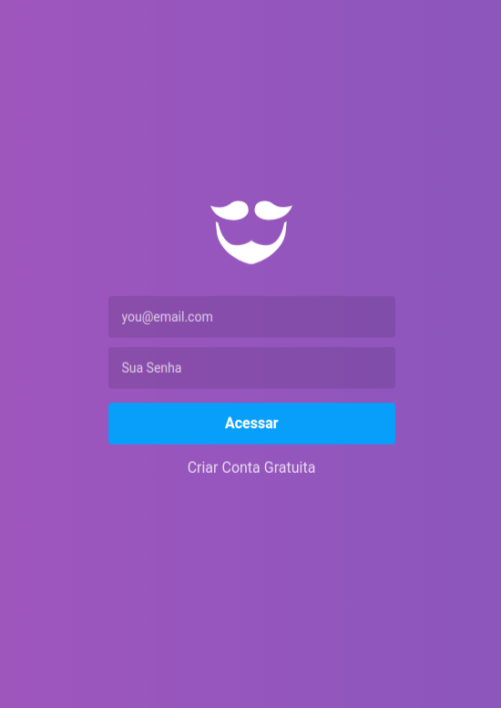
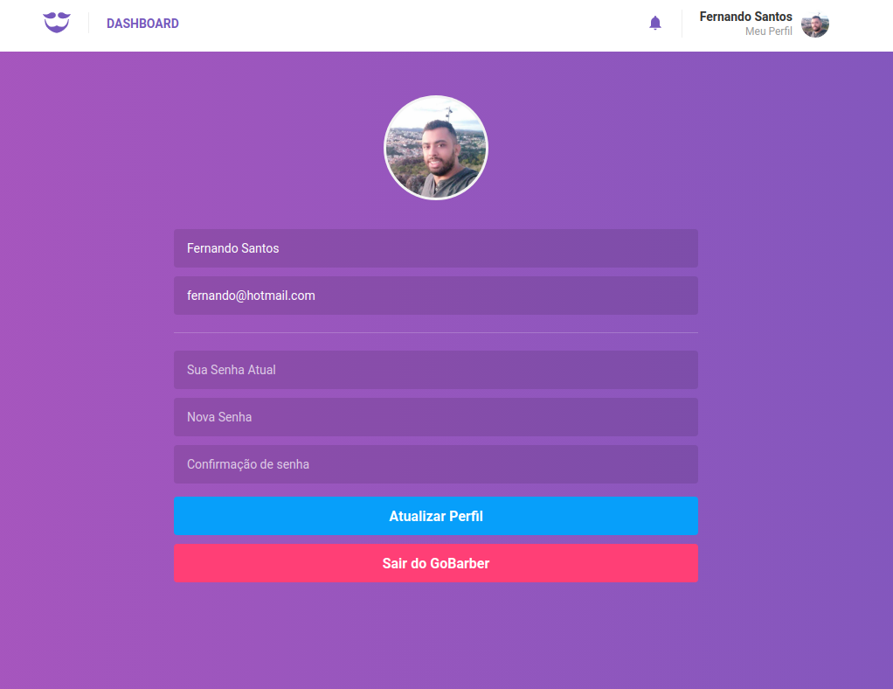

## FrontEnd GoBarber desenvolvida com as tecnologias:

- ReactJs
- Redux
- Redux-Saga
- Styled-Components
- Redux-Persist
- Yup
- Axios
- Immer
- Entre outras


## Para iniciar o projeto

Adicionando Repositorios:

```js
yarn
```


Iniciando a aplicação:

```js
yarn start
```


### Segue imagens da aplicação:


> Tela de Criação de Conta e de login na aplicação!

</img>
</img>


> Tela do Dashboard da aplicação:

</img>


>Tela do Profile, para atualização dos dados e Avatar

</img>


## Criado por:

Fernando Santos – [@Fernando](https://www.linkedin.com/in/fernando-santos-686632122/) – fernandorato.0@hotmail.com

Faz Parte do bootcamp GoStack 9 da [RocketSeat](https://rocketseat.com.br/bootcamp)


## Contributing

1. Faça o _fork_ do projeto
2. Crie uma _branch_ para sua modificação (`git checkout -b feature/gobarber`)
3. Faça o _commit_ (`git commit -am 'Add some feature'`)
4. _Push_ (`git push origin feature/gobarber`)
5. Crie um novo _Pull Request_
