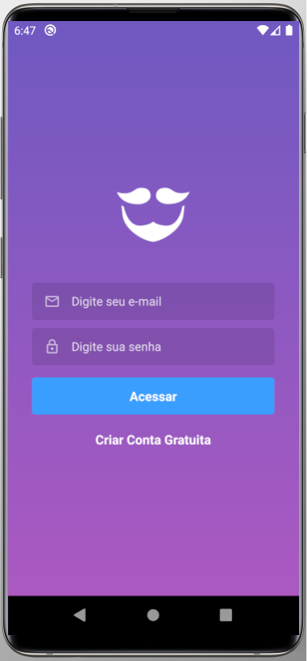
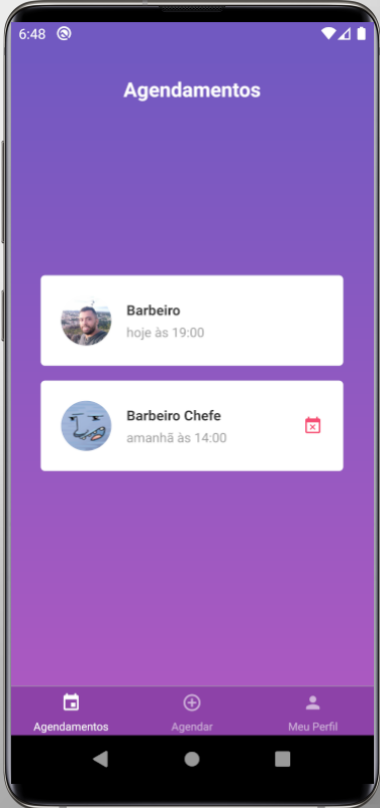
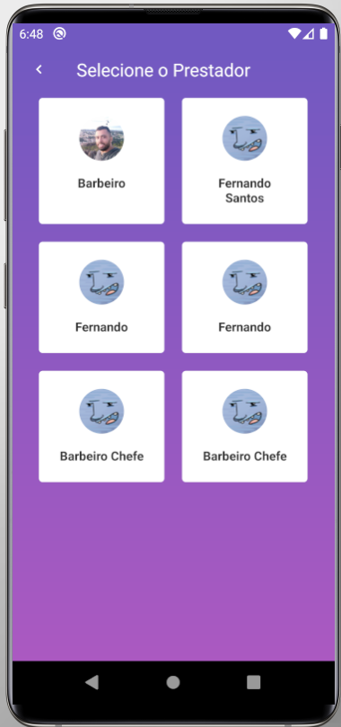
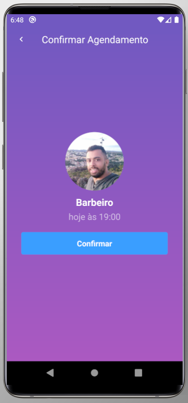
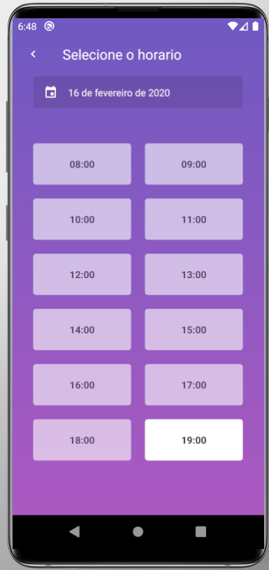

<h1 align="center">
  
</h1>

<h3 align="center">
  GoBarber Mobile
</h3>


## :rocket: Gym Point
> App para controle de academia, agendamento de alunos, dos administradores, planos, controle de frequencia.


## Versão Mobile do Gobarber!


<p> Para executar essa aplicação, clone o repositorio na sua maquina!</p>
<p> Tenha o emulador do sistema que for usar instalado no computador, no caso foi usado o Android, com o Android Studio</p>
<p> rode o yarn, ou npm para instalar os pacotes da aplicação: </p>

```js
yarn
```

<p> Apos instalar os pacotes do node_modules, instale o aplicativo no emulador android, com o comando:</p>

```js
react-native run-android
```


<p>Agora execute a aplicação:</p>

```js
react-native start
```


>Segue abaixo algumas imagens do App:

</img>
</img>
</img>
</img>
</img>
</img>


## Criado por:

Fernando Santos – [@Fernando](https://www.linkedin.com/in/fernando-santos-686632122/)
